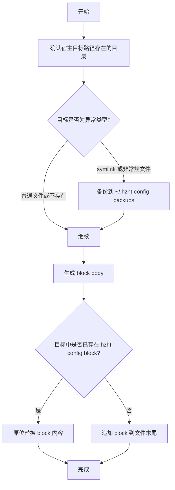
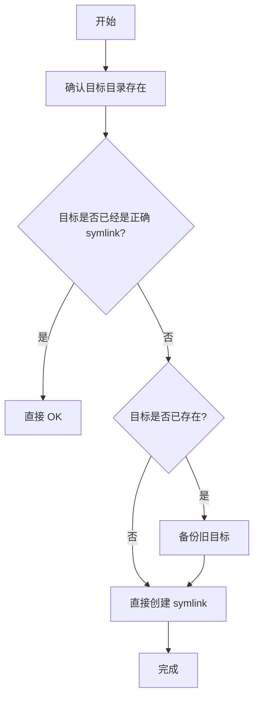
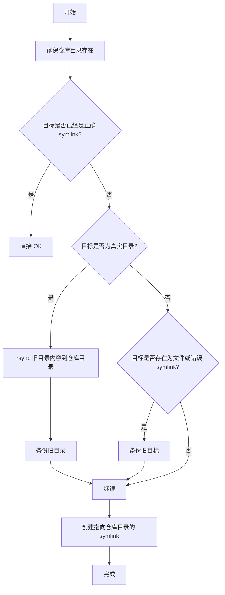

# hzht-config

Low-friction dotfiles repo for `agents` skills, `codex`, `cursor` AI assets, `claude`, `zsh`, and `tmux`.

## Structure

- `references/theniceboy-config/`: read-only reference clone of `theniceboy/.config`
- `zsh/`: shared zsh fragments
- `agents/`: shared universal skills source of truth
- `claude/`, `codex/`, `cursor/`: tracked app config and AI assets
- `.zshrc`, `.zprofile`, `.zshenv`, `.tmux.conf`: repo-owned entry files
- `herdr/config.toml`: shared Herdr workspace and keybinding configuration
- `scripts/bootstrap.sh`: insert or update managed host blocks and create symlinks
- `scripts/check.sh`: verify expected managed blocks and symlinks
- `scripts/test_managed_block.sh`: shell unit tests for managed block behavior

## Quick Start

```bash
./scripts/bootstrap.sh
./scripts/check.sh
```

## New Device Setup

1. Clone this repo and run:

```bash
./scripts/bootstrap.sh
./scripts/check.sh
```

2. Install the local prerequisites that this repo assumes:
   - Node.js `v20.19+` with `npx` available
   - Chrome stable or newer if you want to use the `chrome-devtools` MCP server
   - Codex CLI if you use Codex from the terminal

3. Understand when `npx skills` is needed:
   - The shared skills in this repo are stored under `agents/skills/` and become `~/.agents/skills` after `bootstrap.sh`.
   - For the already-backed-up shared skills to exist on a new device, you do not need to separately install the `skills` package globally.
   - You do need `npx skills` when you want to import new third-party skill packages, update them, remove them, or create compatibility installs for other agents.

4. Useful `skills` commands:

```bash
# Install a public skill package globally
npx skills add -g vercel-labs/agent-skills

# Install from a git URL
npx skills add -g git@github.com:kepano/obsidian-skills.git

# List global skills
npx skills list -g

# Remove a skill
npx skills remove <skill-name> -g -y
```

5. Verify the tracked Chrome DevTools MCP entry in Codex:

```bash
codex mcp list
```

The shared Codex config in this repo already contains a `chrome-devtools` MCP entry, so on a new device you usually only need the local prerequisites above.

## Managed Paths

- `~/.zshrc` (managed block that sources the repo copy)
- `~/.zprofile` (managed block that sources the repo copy)
- `~/.zshenv` (managed block that sources the repo copy)
- `~/.tmux.conf` (managed block that sources the repo copy)
- `~/.cursor/mcp.json`
- `~/.config/herdr/config.toml`
- `~/.agents` (symlinked to `agents/`, as a repo-managed working directory)
- `~/.codex` (symlinked to `codex/`, as a repo-managed working directory)
- `~/.claude` (symlinked to `claude/`, as a repo-managed working directory)

## 同步模型

这个仓库当前只做三种同步，不额外发明一层 `spec` 配置协议。原因很简单：这里真正要表达的是三种不同的同步语义，而不是一组看起来“更抽象”的字符串表。

### 1. 入口文件托管块同步

适用对象：

- `~/.zshrc`
- `~/.zprofile`
- `~/.zshenv`
- `~/.tmux.conf`

目标：

- 保留宿主文件
- 只维护一个 `hzht-config` 受控 block
- 让宿主文件 `source` 仓库里的真正入口文件



### 2. 单文件软链同步

适用对象：

- `cursor/mcp.json -> ~/.cursor/mcp.json`

目标：

- 仓库文件就是唯一真实来源
- 宿主路径直接软链过去



### 3. 仓库接管目录同步

适用对象：

- `agents -> ~/.agents`
- `codex -> ~/.codex`
- `claude -> ~/.claude`

目标：

- 如果宿主目录里已有内容，先把已有内容尽量合并到仓库目录
- 再把宿主目录切成指向仓库目录的 symlink
- 目录里的哪些内容真正参与跨机器同步，由仓库 `.gitignore` / allowlist 决定



这三类同步的关键区别不是“路径长得不一样”，而是：

- 入口文件需要保留宿主文件，所以用 managed block
- 单文件配置以仓库版本为准，所以直接 link
- 仓库接管目录需要迁移宿主已有内容，所以先 adopt 再 link

对于 `agents`、`codex`、`claude` 这类目录，仓库接管的不是某一个“标准配置文件”，而是一个长期工作的配置目录。哪些内容应该进入 Git，由仓库的 allowlist `.gitignore` 决定；哪些内容只保留在本机运行时，也同样留在这个目录里，但不进入版本控制。

## Local Overrides

Keep machine-specific settings out of the repo.

- `~/.zshrc`: keep machine-specific shell additions outside the managed block
- `~/.zprofile`: keep machine-specific login-shell additions outside the managed block
- `~/.zshenv`: keep machine-specific minimal env additions outside the managed block
- `~/.tmux.conf`: keep machine-specific tmux additions outside the managed block
- `~/.agents/skills`: add or import skills here when you want them synced by Git
- `~/.codex/config.toml`: lives inside the symlinked `codex/` directory and is tracked as shared Codex config
- `~/.claude` and `~/.codex`: runtime data can exist inside the symlinked repo working tree, but only the allowlisted files should go through Git

## Deployment Model

- `zsh` and `tmux`: local host entry files stay normal files and contain a managed block that sources the repo entrypoint
- `cursor/mcp.json`: managed as a single-file symlink
- `herdr/config.toml`: managed as a single-file symlink
- `agents`, `codex`, `claude`: managed as repo-owned working directories via directory symlink
- If the repo path changes, rerun `./scripts/bootstrap.sh` to rewrite the managed block paths

The managed block marker defaults to `hzht-config`; only use a custom block id if a file genuinely needs multiple independently managed blocks.

Cursor desktop settings and keybindings are intentionally excluded because Cursor already syncs them.

## Notes

- Git uses an allowlist-style `.gitignore`: ignore everything by default, then explicitly unignore only the repo-owned files and directories.
- `agents/skills/` is the canonical skills directory for this repo; do not add new shared skills under `codex/skills/`.
- This repo intentionally does not sync auth, sessions, history, sqlite, caches, or extensions.
- `codex/config.toml` is tracked; other Codex runtime files can exist in the symlinked repo working tree, but stay untracked via the root `.gitignore`.
- `claude/` and `codex/` follow the same model: the directory is repo-managed, but Git only carries the allowlisted subset.
- Do not put `[projects."/absolute/path"]` trust rules in `codex/config.toml` if you want that file to remain portable between machines.
- Cursor editor settings live in `~/Library/Application Support/Cursor/User/` on this macOS setup, but this repo does not manage them.
- `references/theniceboy-config/` is for comparison and selective copying only; it is not deployed by `bootstrap.sh`.

## Official Links

- Open agent skills CLI:
  - GitHub: https://github.com/vercel-labs/skills
  - Overview: https://vercel.com/changelog/introducing-skills-the-open-agent-skills-ecosystem
  - Guide: https://vercel.com/kb/guide/agent-skills-creating-installing-and-sharing-reusable-agent-context
- Chrome DevTools MCP:
  - GitHub: https://github.com/mcp/chromedevtools/chrome-devtools-mcp
  - Chrome for Developers overview: https://developer.chrome.com/blog/chrome-devtools-mcp
- Codex:
  - Product page: https://openai.com/codex
  - MCP docs: https://platform.openai.com/docs/docs-mcp
